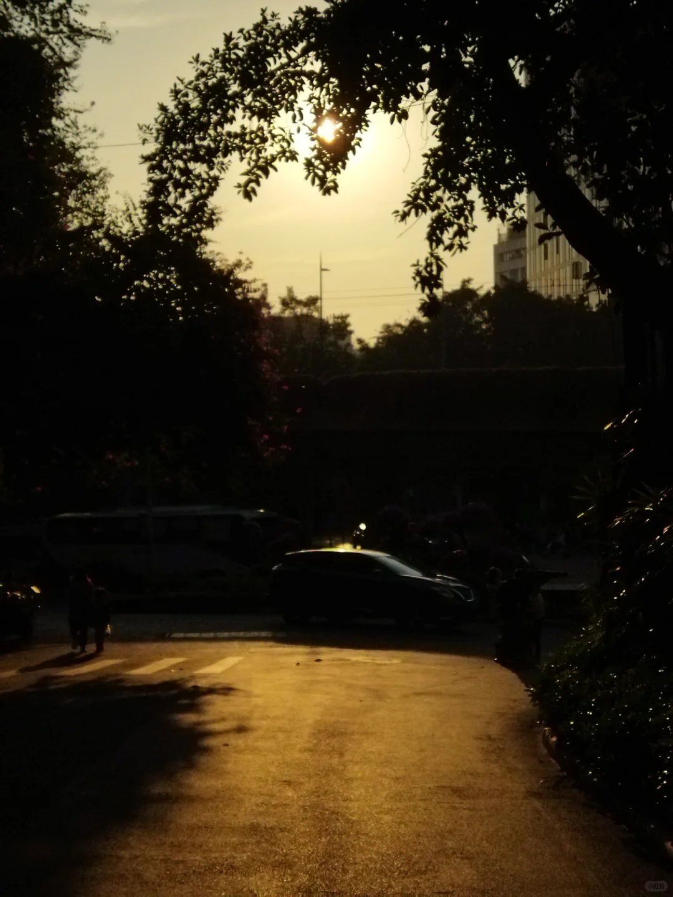

{width="50%" height="50%"}
今天下午和两位搭子一起去散步，原本计划是去流花湖公园散步，走到了一半就去到越秀公园那边散步，后面一位搭子有事先走啦跟另一个搭子继续走越秀公园。越秀公园那边的路有一点陡，如果太久没运动的话可能会有点费力，流花湖公园就是平路，而且风景很不错，也是环湖，就很适合散步 🌳。
三个人都是i人，搭子开玩笑说"为i做e"（可能是我话比较多吧），我自己的mbti是isfj，搭子说适合找enfj的朋友，也许下次会有enfj的朋友想和我散步哈哈哈。😊
和我一起走越秀公园的搭子运动能量很强大⚡️，她说她之前都是找徒步搭子，我一直以为徒步和散步都一样，原来徒步那种就是见面就一起走路，但不怎么交流的。她说之前有个搭子就是见面之后走路就戴耳机🎧，然后就只管运动。我和她一起走路，有时候都要休息一下（因为她走的有点快）再加上爬坡就很容易出汗哈哈哈。（运动量非常达标的一天）💪
