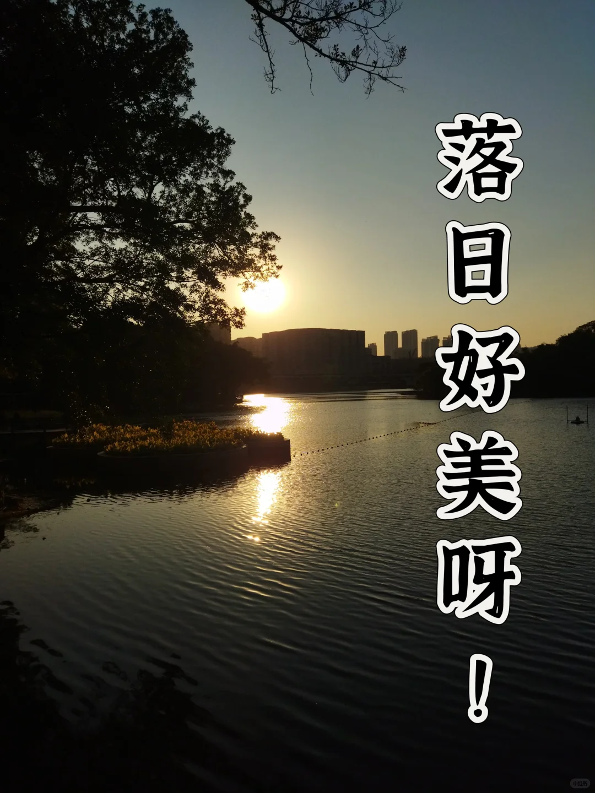
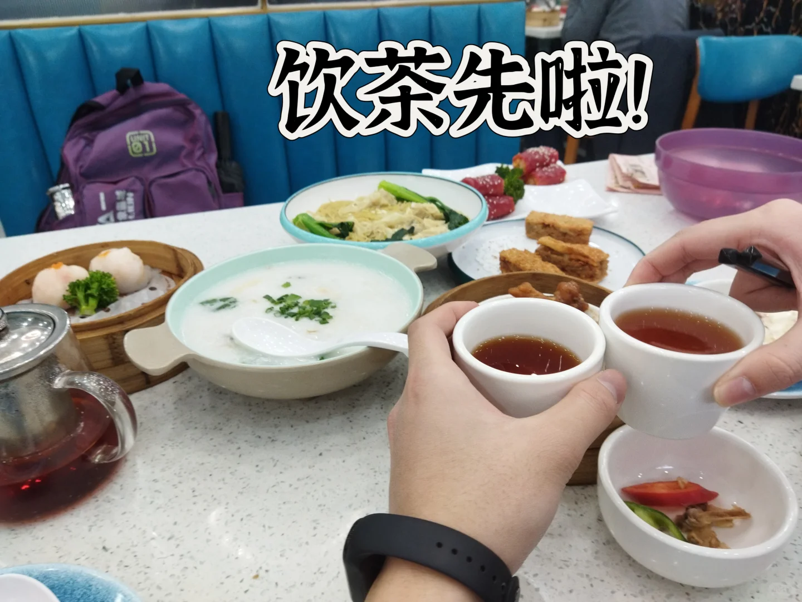
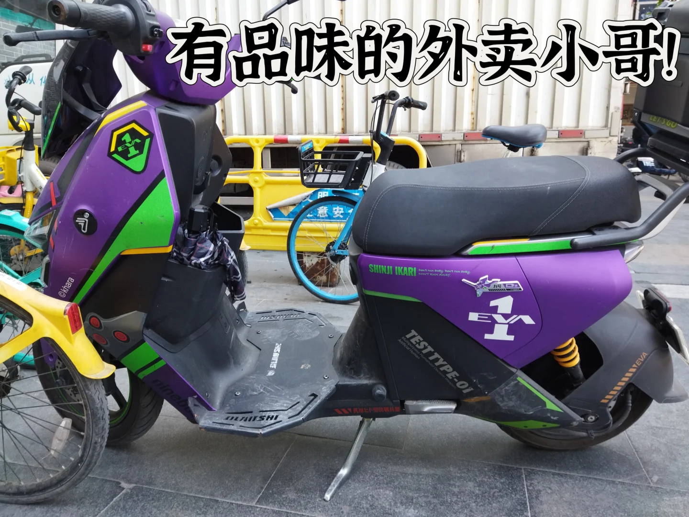
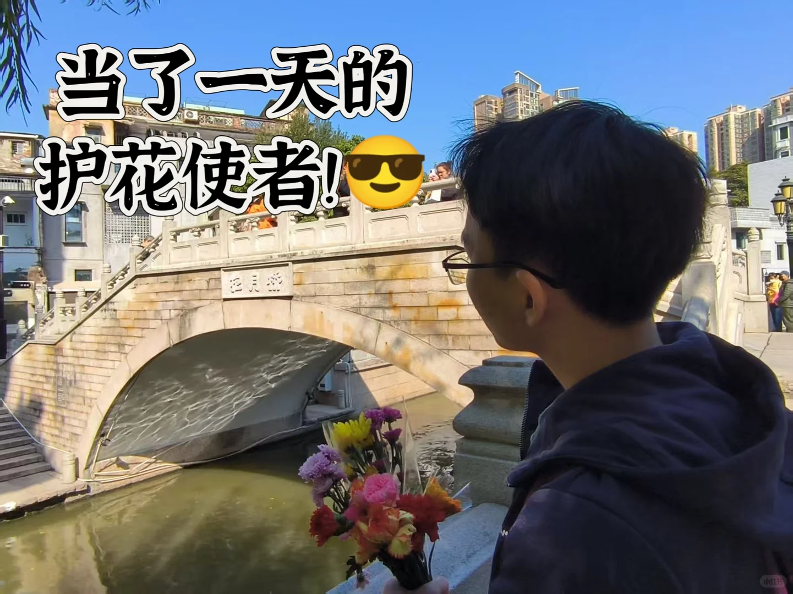
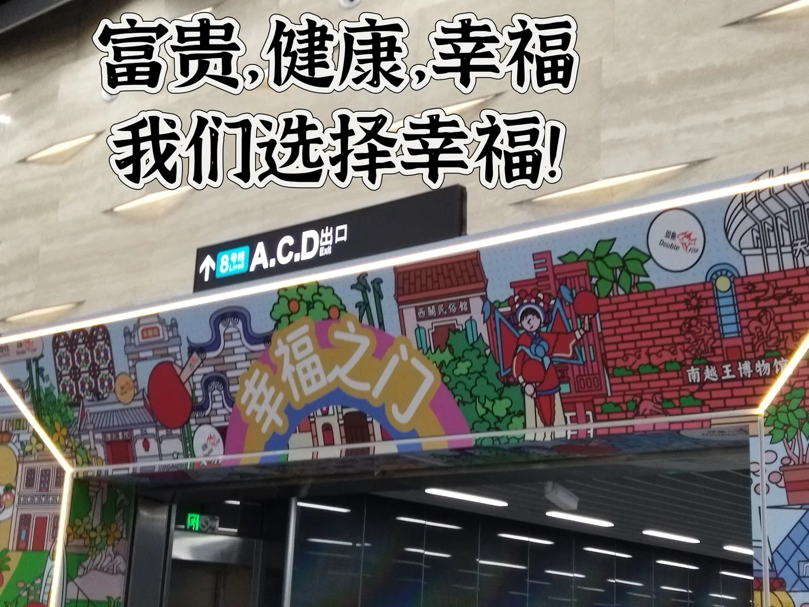
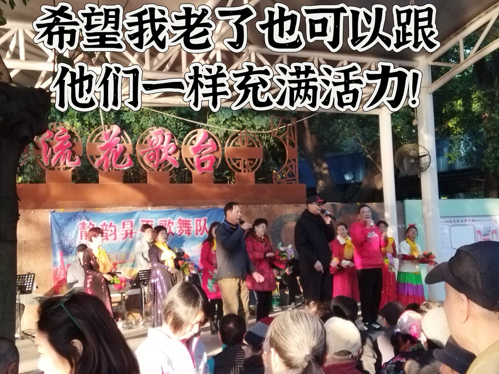
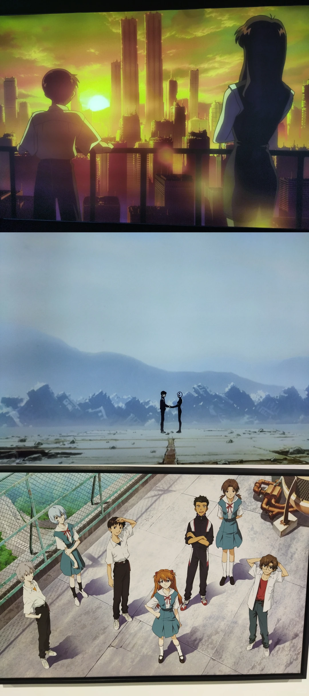
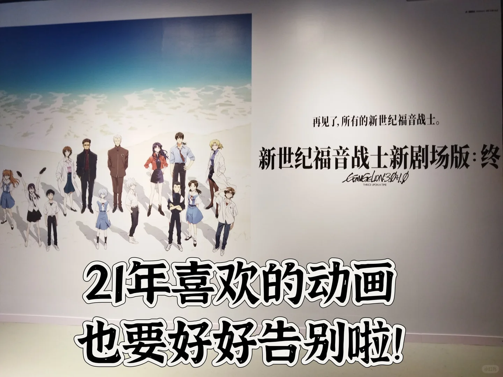
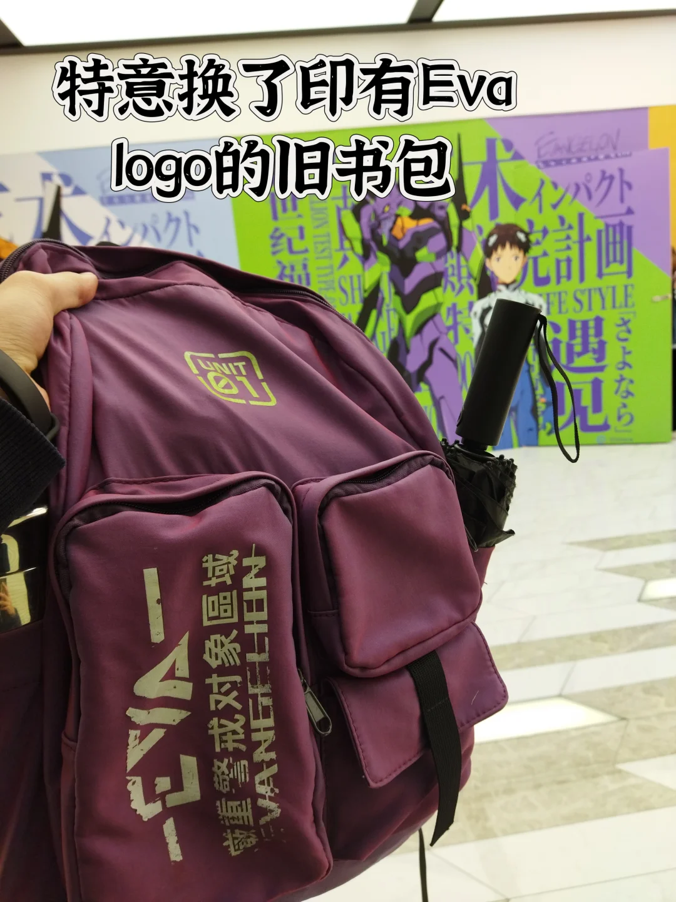
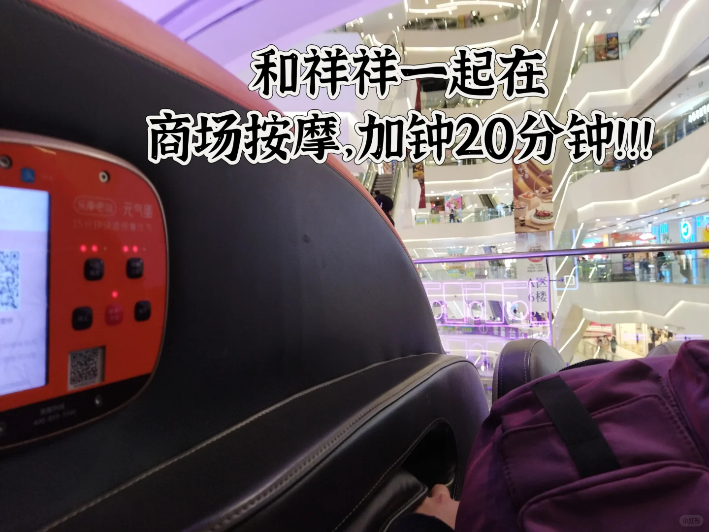

{width=50%}
芸香居的早茶十一点前买单离座有五点多折🤩，里面很多老年人喝茶老人 🧓。
{width=50%}
{width=50%}

"我们两个一看就是假的广东人，点了茶点还点了粥面，面还一口没吃，被别人看肯定要被笑"
​
​光孝寺的门票五块钱，我:"佛祖不是普度众生吗？怎么还收门票"，献花拜佛之后可以免费领花 🌸。
​
​拿着寺里给的花，路过永庆坊当了一路的护花使者[得意]，走到荔湾湖公园送给了唱歌的阿姨大叔 🎶。
{width=50%}

"为啥不送她花？"
"因为她老伴就在那里，我要送给那些一个人唱歌的，他们看起来更孤独"
{width=50%}
​
​荔湾湖公园的人很多，可以两个人一起坐着但没人打扰晒太阳的地方很少 ☀️，两人决定去流花湖公园，走完未走的路。
"她应该是要去跑步吧，只是在我们前面热身"🏃
十分钟过去了，阿姨开始在我们前面跳舞💃
​
​流花湖里也有很多人在唱歌🎤，甚至大爷在搞摇滚（太强了！希望我以后也可以有他们这种精神状态）
{width=50%}

和她一起看落日🌅，她的手好温暖啊
{width=50%}

​{width=50%}
​最后一起到北京路看Eva展，跟21年喜欢的动画好好告个别吧。
​{width=50%}
​{width=50%}
（感谢祥祥陪我商场按摩语音聊天二十分钟，还加钟了二十分钟，希望我们以后不要在商场发出那种奇怪的声音了）
​{width=50%}
