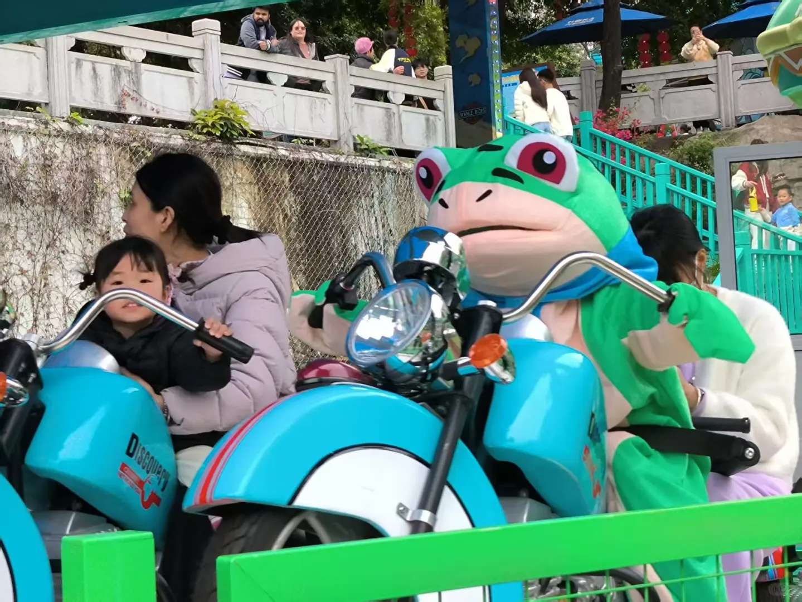
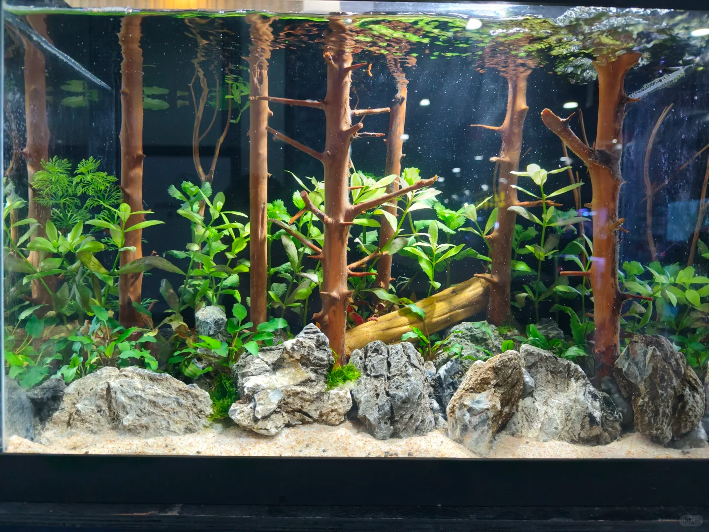
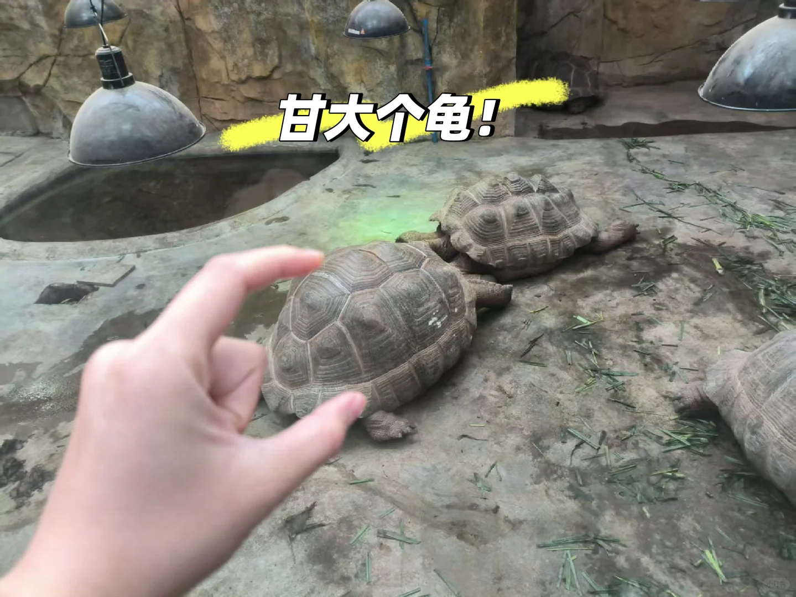
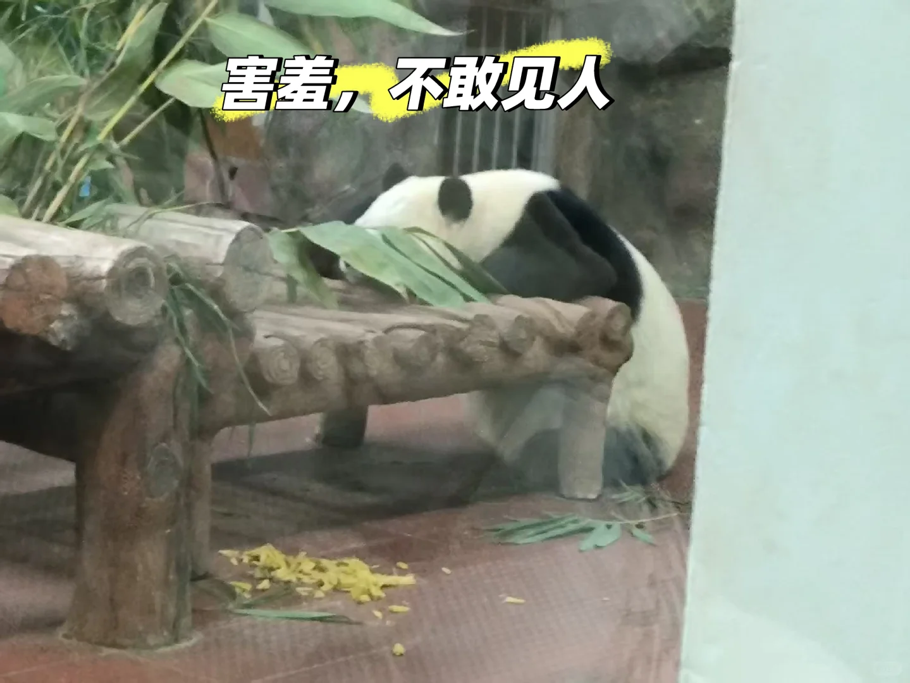
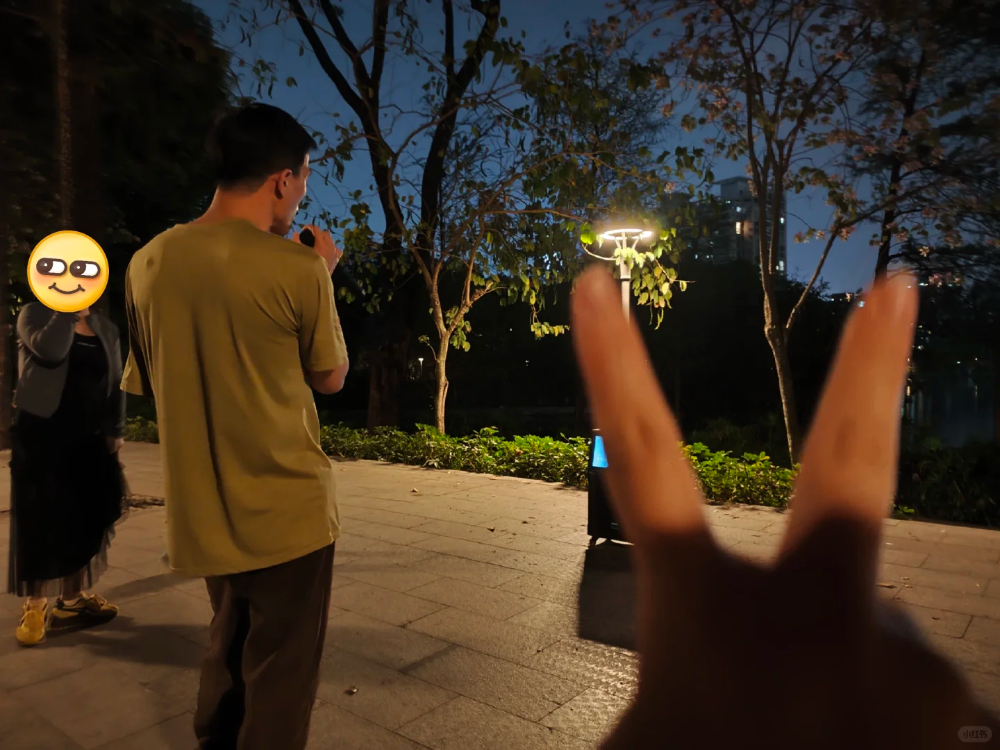
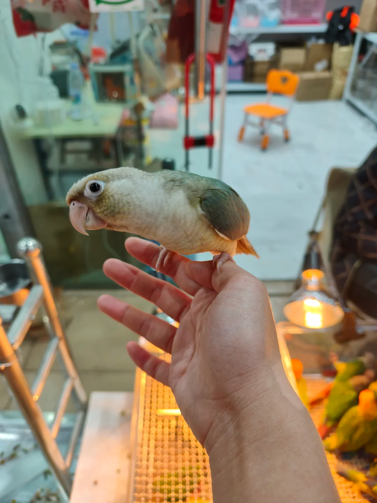
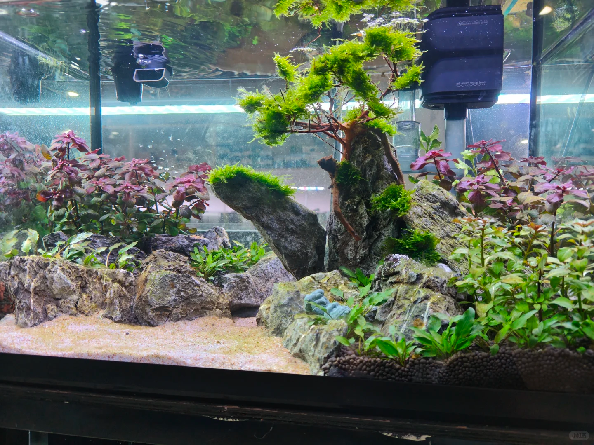
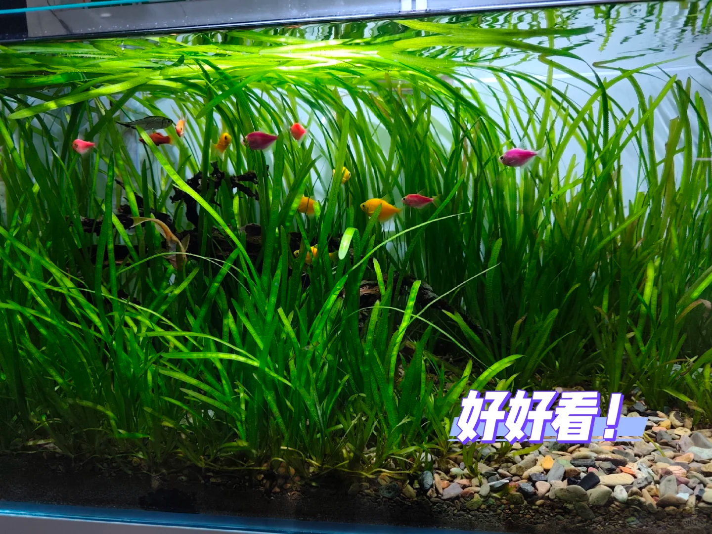
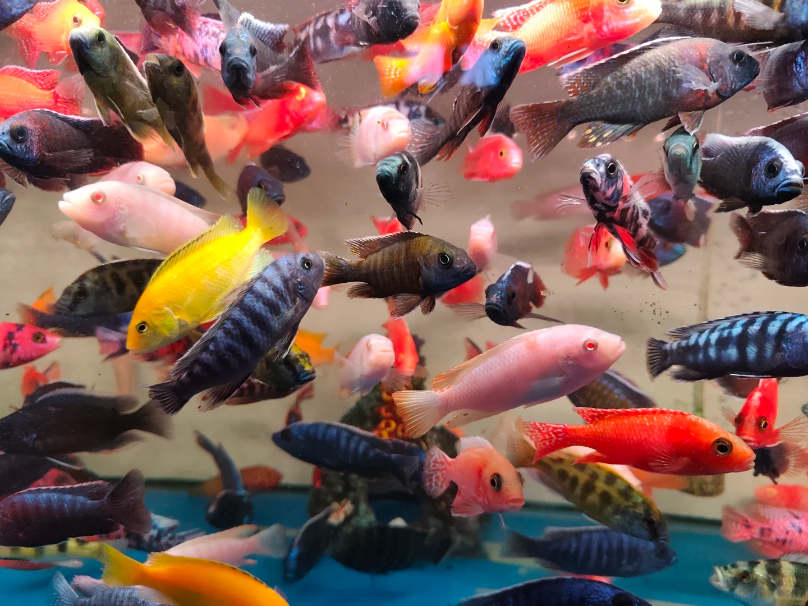

{width=50%}
最近去了这几个地方散步，见花草🌿，见生灵🐾。
{width=50%}  
广州动物园需要门票，有学生证可以优惠，当时去的时候是下午，逛到后面一些动物看不到了，建议早点去逛。大学期间去了动物园两三次，这次是第一次和npy一起去（**前女友，20260405补充**），里面的动物种类很多，地上走的🦁，天上飞的🦅，水里游的🐟应有尽有。她很喜欢乌龟🐢，里面有个两栖动物的馆，她就给我科普龟的种类，还让我来猜，有些乌龟是个人养不了的，有的龟就非常大！
{width=50%} 
此外还有国宝🐼，但熊猫要看的话就需要排队去看哈哈哈！外面还有一些游乐园🎡，很适合带小孩子去逛！
{width=50%} 

天河公园在上班的地方附近，之前一直想去但没有去，里面有个相亲角很意思 💑，不过我和她都是下班之后才去逛的，就没看到大家在相亲，白天的话可以去看看。晚上也会有一些人在附近唱k跳舞 🎤
{width=50%} 
我很喜欢和她一起去散步 🌿，特别是两个人走到空旷的草地，直接躺在草地上看着夜晚的星空✨。我想，要是白天过去带个野餐布应该会很爽，可以看到广阔的天空☀️。晚上躺着也很舒服，不用担心晒太阳，虽然是在广州市区，但是光污染也不是那么严重，至少可以看到星星嘿嘿。高中的时候读的是文科，地理也学过不少，大学还是天文社的部长，但你让我给你找北斗七星，我都不一定能找出来🌟很喜欢两个人一起躺在草地上，看着夜空，一起讨论未来，人生理想，想过什么样的生活，可以远离工作💼。
我想起了博尔赫斯的一段话:"我心想，一个人可以成为别人的仇敌，成为别人一个时期的仇敌，但不能成为一个地区、萤火虫✨、字句、花园、水流和风的仇敌。 "
	
花鸟虫鱼新世界在芳村，但其实并不是在芳村的地铁站，而是在菊树。环境字如其名，它是广州最大的花鸟虫鱼市场，附近有很多批发生意，从地铁出来就可以看到很多花🌸，接着可以到旁边看到卖很多鸟🐦，特别是一些卖鹦鹉🦜，有的鹦鹉并不会飞，它们也不怕人，你可以走过去把手伸在鹦鹉脚上，它就会跳到你的手上，爪子在你手里的感觉很奇妙，你可以感受到这是一个生命。
{width=50%} 
把手伸到它的嘴边，它还会啄你，它们翅膀还没发育到会飞的程度，尽管会扑腾，但跑不掉。之后我们又逛了水族馆🐟，里面有很多卖鱼缸的，园艺的，生态缸还有很多鱼
{width=50%} 
{width=50%} 
有一些鳄龟超级大只。她又开始给我科普各种各样的龟，很多鱼，缸里一般会有清道夫除污垢。
{width=50%} 

最后就兜兜转转走啦，建议上午或者下午早点来，太晚的话店就关了很多。
