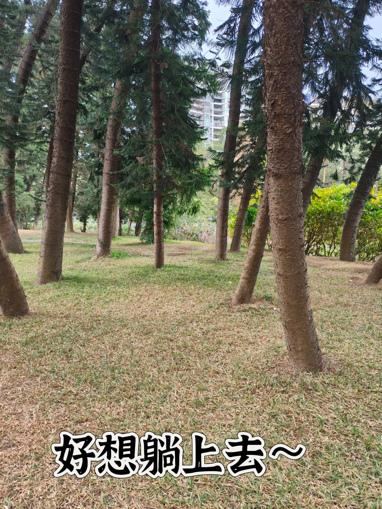
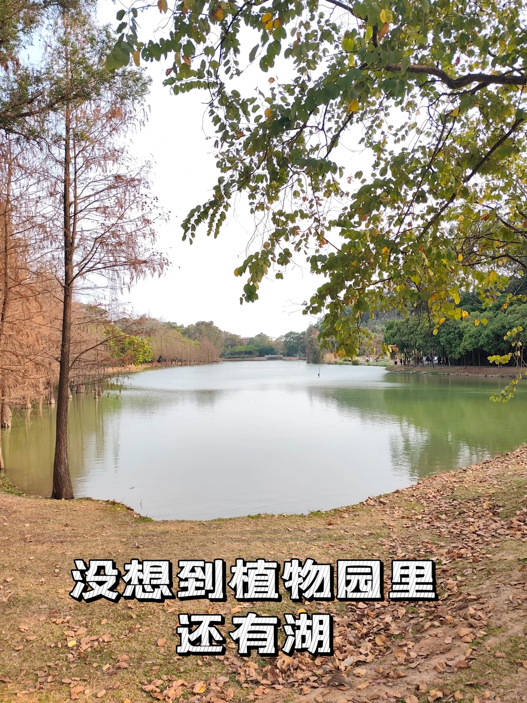
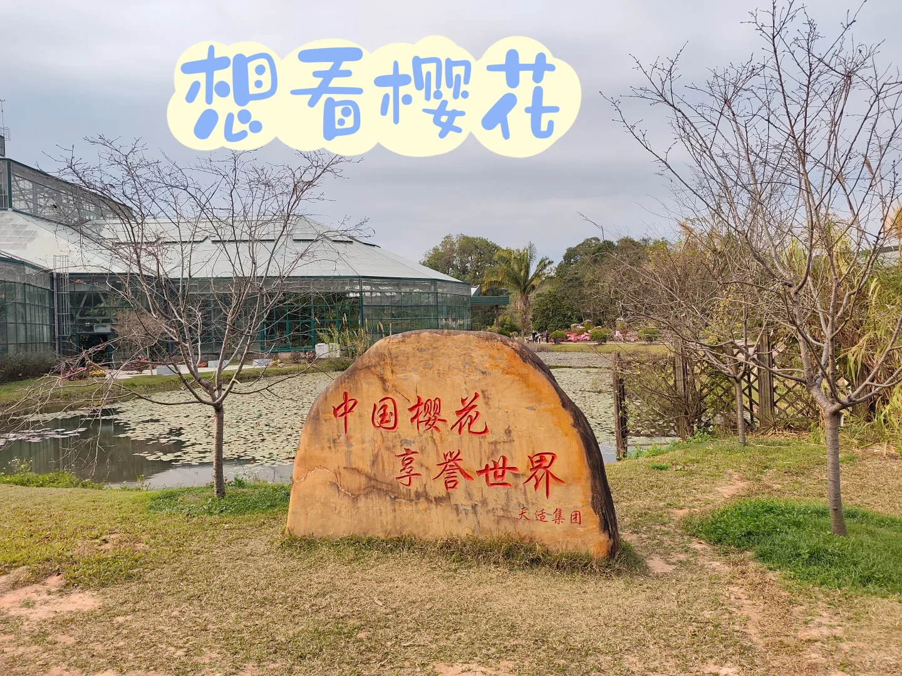
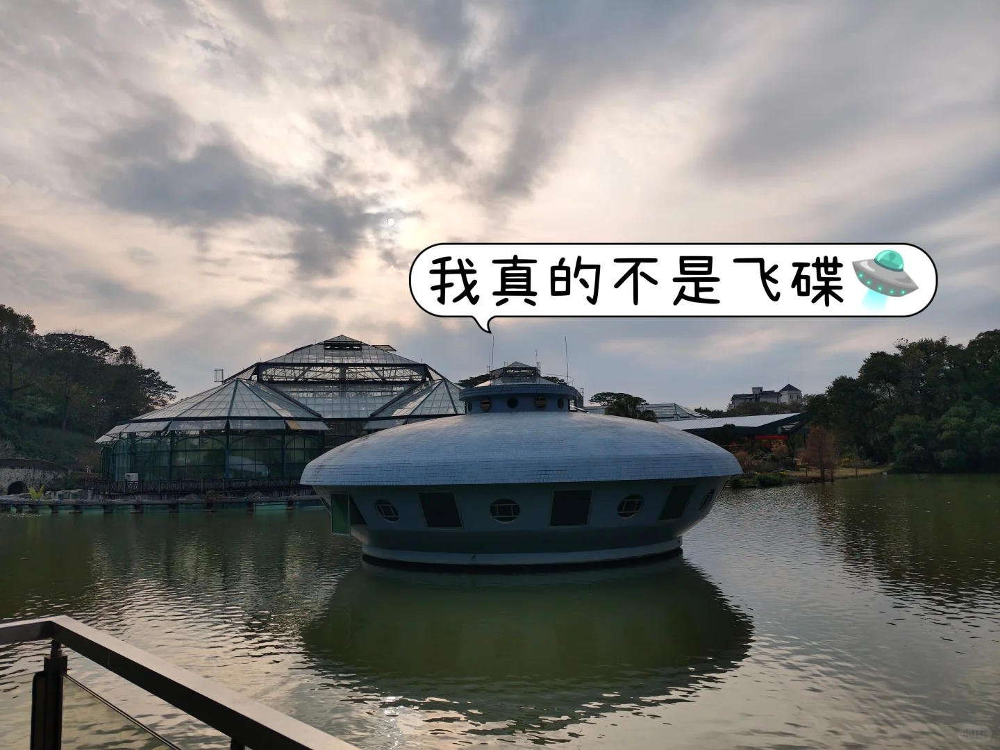
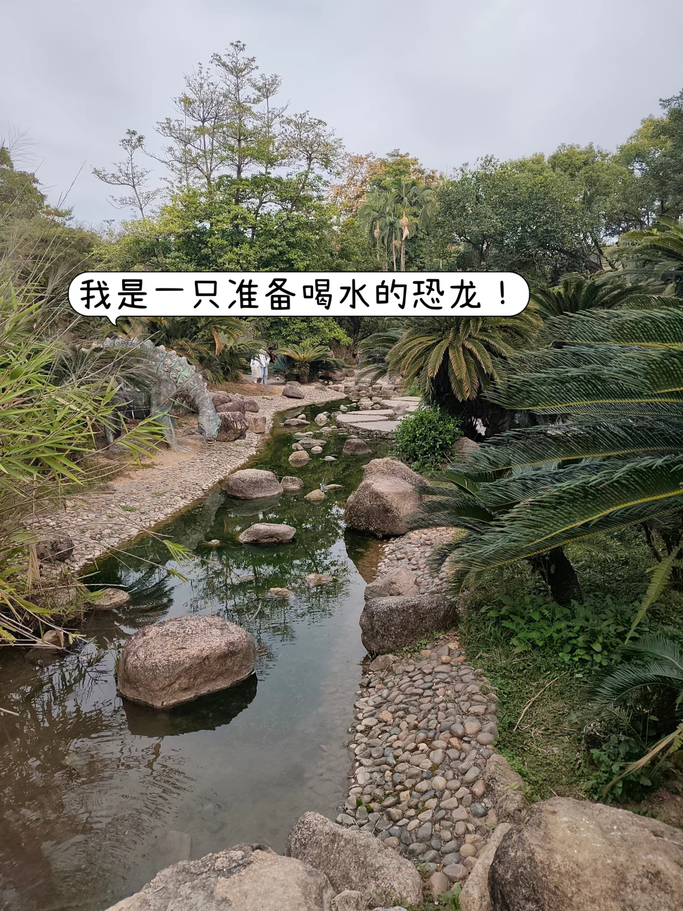
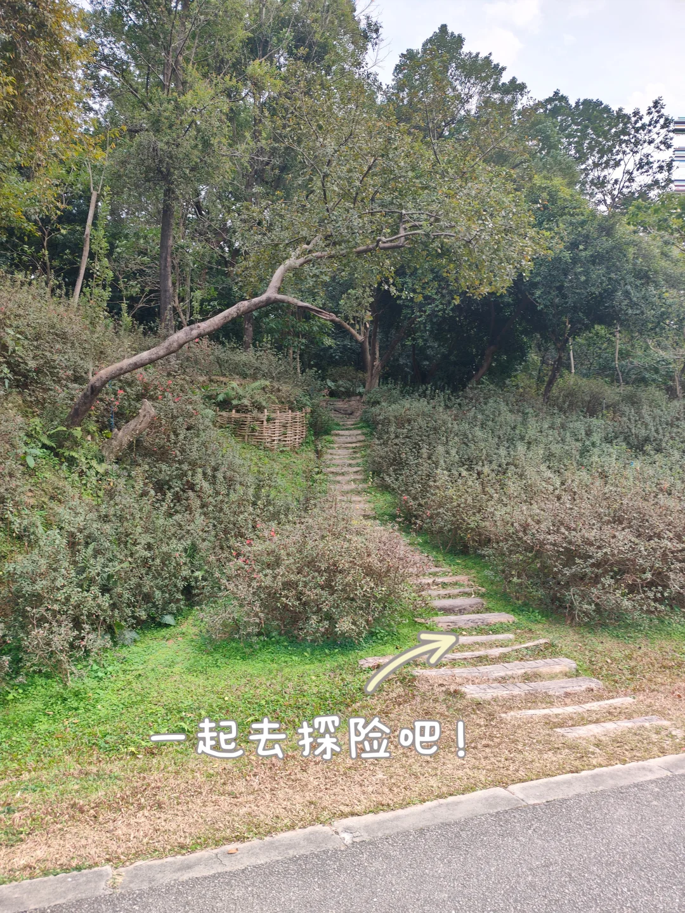
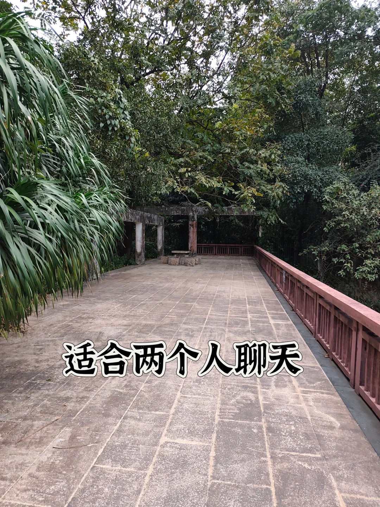
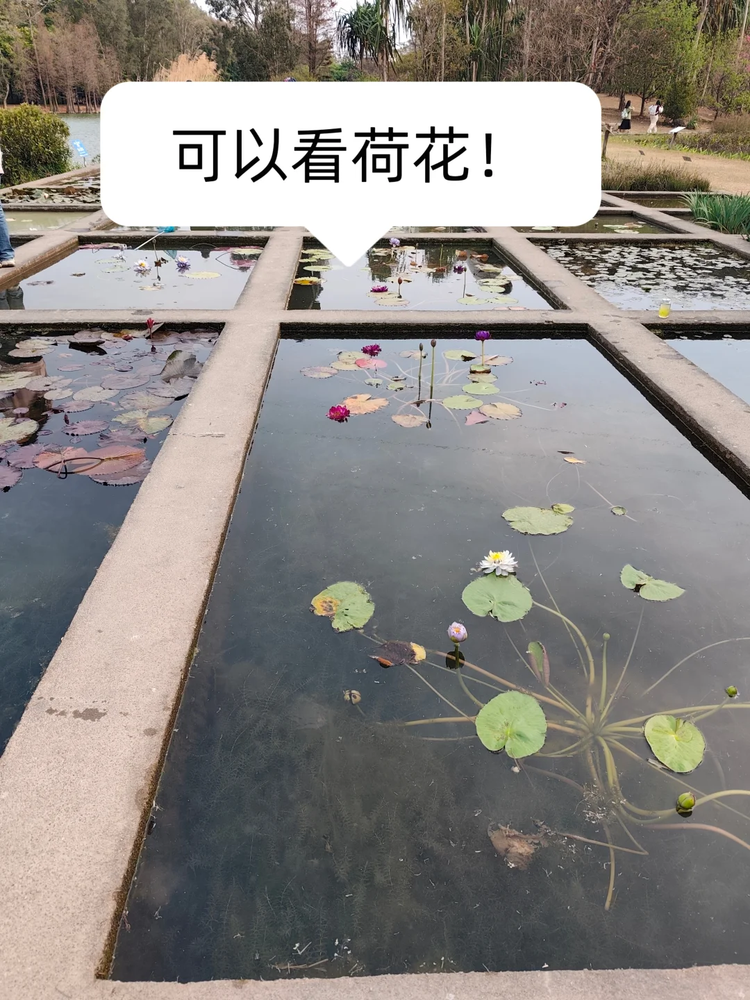
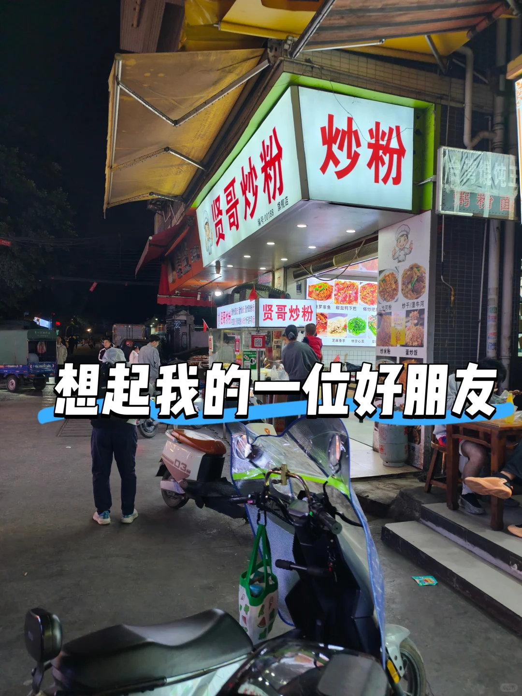
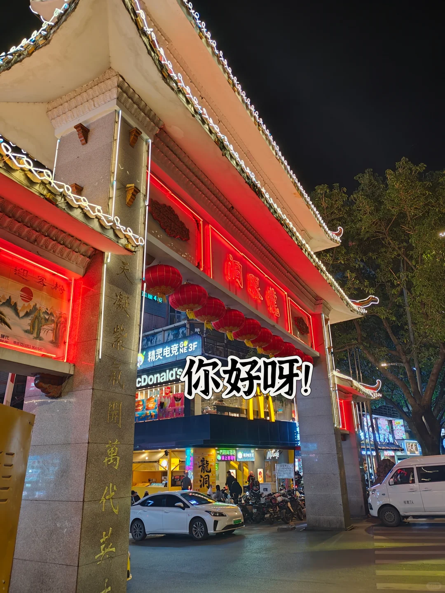

{width="50%" height="50%"}

今天早上学了一会技术知识💻，看了一下mybatisplus多数据源的内容，学到中午有点困又睡了一大觉😴，下午公司群里有同事上班，系统有问题又来找我（假的双休😢）在房间待着有点闷，就想着出来走走，思来想去决定来植物园。上次是以学生身份过来的，这次是以牛马的身份过来的。（学生门票半价只要十块钱，成人票二十块钱）

植物园真的很大，但今天人不多，可能是因为我是快四点过来的，也有可能是快年底了，大家都在准备回家了。但感觉天气有点阴☁️，没有怎么晒到太阳。
{width="50%" height="50%"}
	
植物园里有很多不同种类的植物🌿，进去原本是想着沿着主路走，但中间绕进兰圃后出来就迷路了应该要个小册子看看地图🗺️。兜兜转转绕了一圈最后也没有走完，从北门走到差不多西门，又原路返回了。
	
不得不说，华南的落羽杉真的很好看且里面还有一个湖（我是真没想到植物园里面有湖，门票值了。）在我心目中，广州的环湖公园有三个很不错（流花湖，海珠湖以及大学城的中心湖，当然母校的语心湖也不错前提是有npy）🌊
{width="50%" height="50%"}
{width="50%" height="50%"}
{width="50%" height="50%"}
{width="50%" height="50%"}
	
植物园里有很多草地，超级想要躺上去。以后出门应该带上个野餐布，看到哪里有不错的草地就躺上去，今天出门穿了毛衣，不然真想直接躺上去hh
{width="50%" height="50%"}
{width="50%" height="50%"}
{width="50%" height="50%"}
{width="50%" height="50%"}
{width="50%" height="50%"}
	
逛到差不多五点半就离开了（植物园最晚入园时间是五点半，不是全天开放的），去了附近的龙洞步行街找吃的，那里真的好多吃的🍜。
{width="50%" height="50%"}

记得之前的实习搭子说，龙洞步行街是他们学校的后花园但那位实习搭子和我不在同个公司了，不然每天就有饭搭子了。看到贤哥炒粉就想到我的一位好朋友，可惜他最近在因为年报的事情忙着加班（心疼审计同学）不然就能陪我好好走一走啦，
{width="50%" height="50%"}

最后吃了一个鸡公煲，花了三十二块钱，感觉还行。就是性价比不如母校三饭的鸡公煲（可是它已经不再了，我就算回去再也吃不到它了）。就像有些人，离开了就再也见不到了。😢
{width="50%" height="50%"}
{width="50%" height="50%"}
