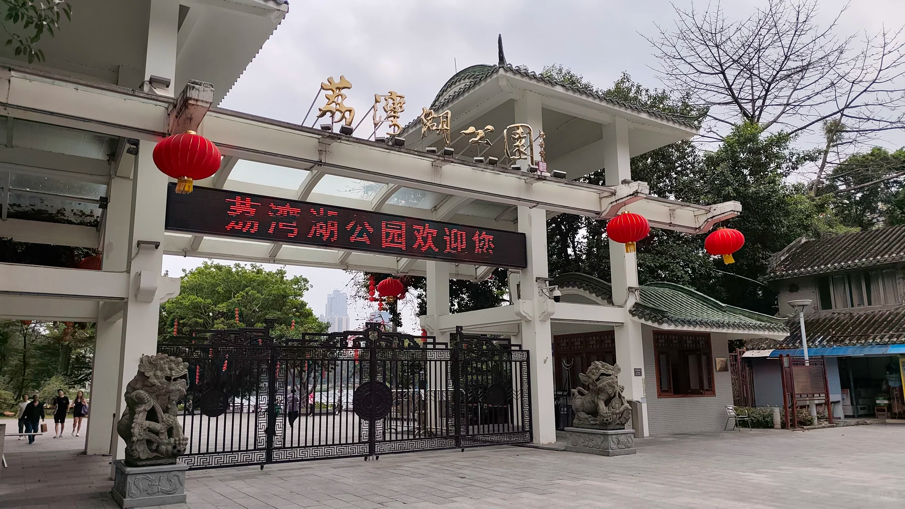

昨天周日去广州见之前鸽了很久的搭子，他是一个高高壮壮的山西男生，一月份的时候他给我留言说他也是计算机专业，后面兜兜转转去做了教培运营工作，想跟我聊一聊。当时年前有点忙，就鸽了好久，上周他提出散步邀约，我就和他约定今天去荔湾湖公园散步了。和他聊天很愉快，他的声音很温柔有亲和力，他说他并不太会写代码，但积累了几段不错的大厂实习经历（小米、博世、小天才），最后因为一些原因来到了广州的教培行业做运营，我们互相分享了实习经历，谈谈未来行业发展，聊聊职业规划，围着荔湾湖兜兜转转走了几圈。（这里就不得不说环湖公园了，荔湾湖不是完整的环湖公园，走着走着就走到马路边了，但是它近永庆坊，附近也有挺多好吃的:star_struck:）
荔湾湖公园不是很大，很快就能走完，后面又想着去天河公园那边见好朋友，就和他一起去天河公园躺了会草地（这周顺峰山公园没躺成，就去躺天河公园的草地吧），傍晚和他分离后，又陪好朋友去配眼镜。（关灯后真的不能躺着玩手机，度数会飙升的）
晚上坐地铁回佛山，回到房间又看了一会代码，明天又要上班苦昼短:sob:下周我一定要去顺峰山公园躺草地！:star_struck:希望不要下雨了！:pleading_face: