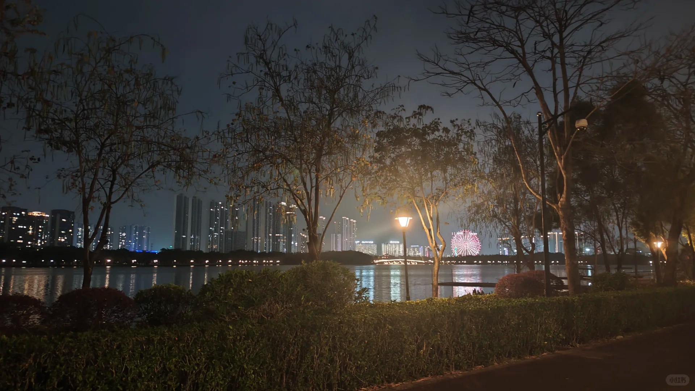

今晚又出来顺峰山公园散步了，今天搭子是一个大我几岁的哥哥，他和我很有缘。因为上次和大姐姐散步的时候，他就在附近，听到了我们的一些对话，他说那天他回到家刷小红书就刷到了我的帖子，结果一聊发现我就是他路上遇到的人。
	
今晚的天气也很好，来的时候有毛毛细雨，还担心会不会下雨，没想到老天保佑，没有下雨:blush:让我和搭子能够安心散步。今天的搭子在律师行业工作，跟我分享了他之前的前几份工作，他说之前工作的时候也没想到会来到现在的行业，但命运把他推到了这个行业。和他聊天我感受到了一股旺盛的生命力。他说：**“我很期待我的三十岁，因为我经济独立，人格独立了，我感觉现在才是我的十八岁！”**:grinning:
	
我和他都是i人，但我们两个人都能聊好多东西，他说：“不要内耗，尽管外耗出去”。我的mbti是isfj，所以可能会比较关心别人，从别人角度看问题。路上有人从后面骑车骑得很快过来，我提醒搭子：“小心，要让一让。”他说：“不用怕，撞到我们就是他的问题了。”我恍然大悟，有道理！对呀，我走在人行道上为啥要让一让。（感觉顺峰山公园有一些地方人车分离好像不太好）
	
搭子还带我逛了公园的大圈和小圈，还跟我说哪里是富人区，带我去一条路看了很好看的湖景。最后他带我去大融城，跟我说周末哪里打车方便，哪里买奶茶方便，下次就可以轻车熟路了:smiling_face_with_three_hearts:
	
这周学到一个冷知识：**原来顺德人一般不说自己是佛山人，而说自己是顺德人** :grinning:
	
今晚是一个舒服的夜晚，我希望，明天也不要下雨🌧️