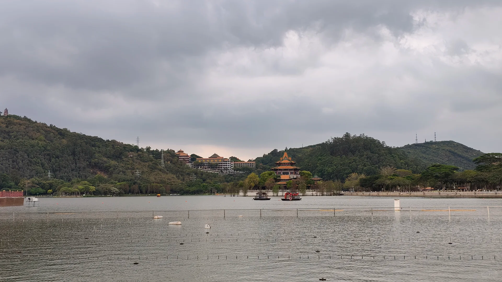

今天下午和一位校友姐姐一起出来散步，原本计划一周就出来一次的，只是一想到未来都是雨天，实在是不想辜负顺峰山公园的景色。:star_struck:（其实还有一个原因是我不想宅着写代码:pleading_face:）
	
**“在这个世界上可以和原本没有交集的人相遇、交谈，本身也是极美好的事情！”**
	
学姐很好，一见面就给我分享了她自己种的小番茄还有青团（好好吃我很喜欢:smiling_face_with_three_hearts:）路上我们沿着公园走了一大圈，她给我分享了陀思妥耶夫斯基的《穷人》和一位加拿大籍印度裔作家的《大地之上》，以及对印度种姓制度的思考，她讲话很有逻辑条理。虽然我从没读过这两本书，但听她讲完之后，我对书的故事很快就有了一个基本的了解。
	
我给她分享了几部科幻小说和游戏（星际拓荒yyds！:blush:），交流一下彼此对社会制度的思考，以及人类社会的荒诞。路上有个小插曲：原本路上没雨的，突然下起了小雨，一群人都跑到建筑物下面避雨，结果没一会就停雨了。（就像上天在捉弄大家，看到大家的狼狈就停雨了:joy:）
	
我很喜欢散步，特别是能和别人一起散步聊天。生命的存在本就没有意义，但我们可以给它赋予意义。谢谢今天我的散步搭子:rose: