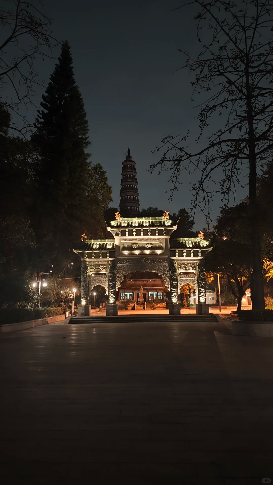

#  向前走，自有新蝉鸣夏，晚风会绕过你的肩膀 
{width="400" height="300"}

这周在看到一个帖子，帖子的主人是一个应届毕业生，他的本科是在小谷围上读的，并且他的恋情也是在岛上开始的，但最近可能过得不顺意，就很想回到最初在大学城读书的时候，回到那个雷雨天后，和女朋友在春风拂面中散步的夜晚。🌧️→☀️

我想回复他，但我不知道怎么表达。于是我就让deepseek老师帮我写了一首诗，它写得很好。✨

**"昨日已沉入珠江，何必再打捞那轮旧月。  
向前走，自有新蝉鸣夏，晚风会绕过你的肩膀。"** 

发完之后我就又想散步了，但这周有一点忙，有挺多需求要开发没有时间出来散步，憋了一个星期。 
晚上约了之前的一位大姐姐出来散步，我送了她一个小礼物🎁，她送了我一个金枪鱼罐头🐟和果蔬饮料🥤（太棒了！可以不用干吃猪脚饭了！🥢→🐟  
感觉附近的外卖吃的有点少，怀念我的贝岗了😭）

一见到面，又是滔滔不绝的聊天💬💬，虽然大多数时间都是我在讲，感谢我的散步搭子没有半路跑掉，愿意听我bbll～姐姐还帮我做了一个眼部按摩👀✨，教我怎么放松肌肉，哇，以后我也要试试绿色的按摩。💚:yum:  
今天还发现，原来顺峰山公园真的会"闭园"的！十点半左右公园的灯就会陆续关掉，所以十点的时候就要收拾走人了。💡→🌙

明天放假三天，但是天气预报好像又是下雨🌧️，可是我好想要☀️，带上我的野餐布🧺，去躺草地🌿，晒太阳！🌞